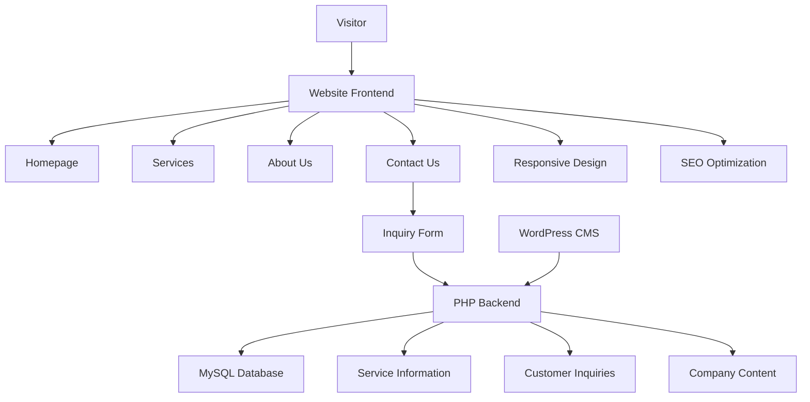

# Architecture Diagram

```mermaid
flowchart TD

A[Visitor] --> B[Website Frontend]

B --> C[Homepage]
B --> D[Services]
B --> E[About Us]
B --> F[Contact Us]

F --> G[Inquiry Form]

G --> H[PHP Backend]

H --> I[MySQL Database]

J[WordPress CMS] --> H

H --> K[Service Information]
H --> L[Customer Inquiries]
H --> M[Company Content]

B --> N[Responsive Design]
B --> O[SEO Optimization]

```
